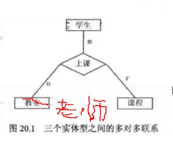
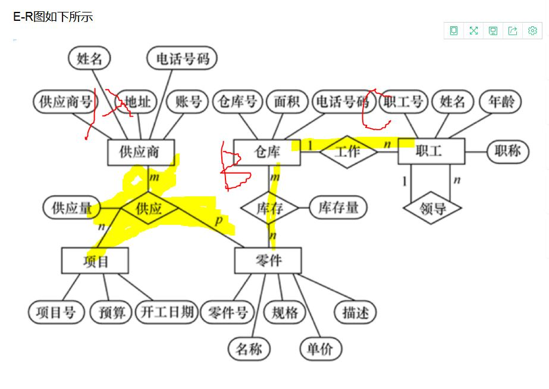

# 程序员求职宝典 数据库真题

标签：MySQL


---

### 1 两个实体型之间的联系有哪些？

- 思路
	- 回答、举例、拓展
- 回答
	- 一对一、一对多、多对多
- 举例
	- 一对一比如学生和学号
	- 一对多比如实体集A中与实体集B中多个实体相联系，如一个班级对应多个同学
	- 多对多指课程和学生之间的对应关系，一门课程可以有多个学生选择， 一个学生也可以选择多门课程
- 拓展
	- 实现表间的联系，从设计角度1：N主外键，N：M中间表。一般外键
	- 外键定义方式
```
mysql>CREATE TABLE a(
id int primary key,
name varchar(20) NOT NULL DEFAULT '',
tid int REFERENCES b(id)
);
mysql>CREATE TABLE a(
id int primary key,
CONSTRAINT 'fk_b' FOREIGN KEY(id) REFERENCES c(id)
);
```

### 2 绘制ER图习题

- ER图概念
	- ER图就是属性-实体-联系
	- 属性圆圈，实体矩形-联系联系，联系上表明关系1:n等
- 该题是三个实体性，并要求多对多联系
	- 
	- 注意三个实体之间多对多用nmp,多对多n..n，一对多1..n，举例
	- 

### 3 笛卡尔积习题

- 若D1={a,b},D2={c,d},D3={e,f}.计算D1*D2*D3
- 解答: {{a,c,e},{a,c,f},{a,d,e},{a,d,f},{b,c,e},{b,c,f},{b,d,e},{b,d,f}}

### 4 简述SQL核心关键字的功能

- SQL语言分为四类，DQL,DML,DDL,DCL
- DQL：SELECT 数据查询~
- DML：INSERT UPDATE DELETE 数据操纵~
- DDL：CREATE ALTER DROP 数据定义~ 创建修改
- DCL：GRANT ROLLBACK COMMIT 数据控制语言 用来授予或回收访问数据的权限，以及控制事物发生的时间等

### 6 使用标准SQL创建表格

- 注意一个UNIQUE表示唯一约束
- 答案提供的numeric(6,2)与DECIMAL(p,s)类似。一般使用精确的用DECIMAL(p,s),`在 Transact-SQL 语句中，带有小数点的常量自动转换为 numeric 数据值`，而DECIMAL向NUMERIC转换时也会导致精度丢失
- 另外，要说明对于不同的数据库支持的数据类型是不同的，Microsoft® SQL Server™ 将精度和小数位数的每个特定组合看作是不同的数据类型，所以DECIMAL(5,0)与DECIMAL(5,2)被当作不同的数据类型.因此会建议在存储过程中使用float
- 不确定是按题目说非空、唯一写，还是按主键写//未给出数据类型，可能需要日后看书按照数据类型优化上考虑分析了
```CREATE TABLE part(
id char(5) not null UNIQUE,
name char(30) not null,
weight numeric(6,2),
city char(20)
);
```
